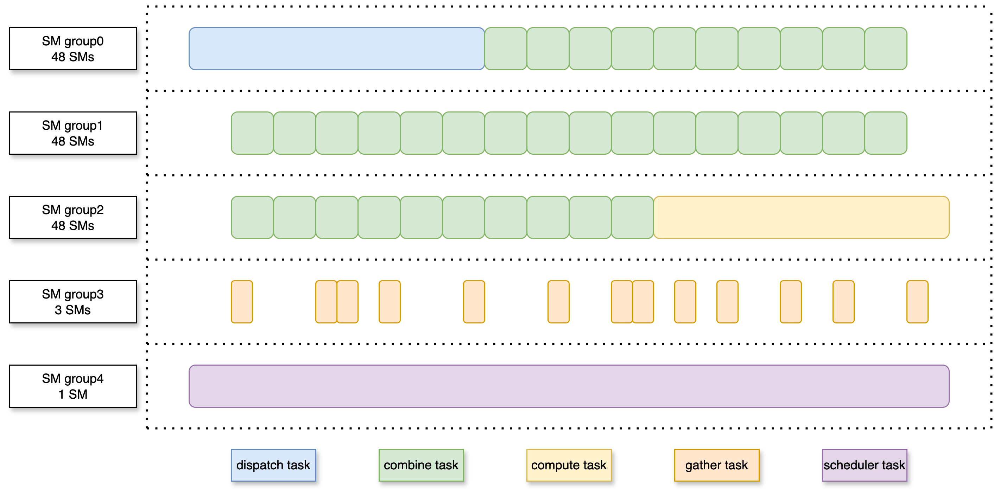
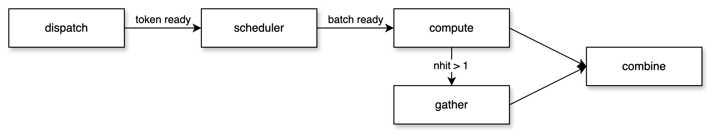

# GigaMOE

> [!WARNING]
> This repository contains an experimental version of GigaMOE. The code is still under active development, and APIs, performance characteristics, and implementation details may change.

GigaMOE is a cross-node Mixture-of-Experts (MoE) training engine that focuses on a fused persistent execution path for dispatch, compute, and combine. It is designed for large expert-parallel (EP) configurations with high communication volume, sparse expert activation, and a large number of experts.

## Performance

### Configuration

| MOE type | hidden_size | intermediate_size | expert_num | topk | dtype |
|:---------|:-----------:|:-----------------:|:----------:|:----:|:-----:|
| MOE_A | 2048 | 3072 | 256 | 6 | bf16 |

### Forward

| num_tokens | EP | Megatron (ms) | GigaMOE (ms) | Speedup |
|:----------:|:--:|:-------------:|:------------:|:-------:|
| 8192 | 32 | 7.584 | 6.609 | 1.14x |
| 16384 | 32 | 11.847 | 10.944 | 1.08x |
| 32768 | 32 | 21.907 | 19.672 | 1.11x |
| 8192 | 64 | 7.158 | 5.770 | 1.24x |
| 16384 | 64 | 11.682 | 10.360 | 1.12x |
| 32768 | 64 | 21.759 | 19.677 | 1.10x |

### Backward

| num_tokens | EP | Megatron (ms) | GigaMOE (ms) | Speedup |
|:----------:|:--:|:-------------:|:------------:|:-------:|
| 8192 | 32 | 8.886 | 7.443 | 1.19x |
| 16384 | 32 | 15.995 | 13.456 | 1.18x |
| 32768 | 32 | 30.493 | 24.702 | 1.23x |
| 8192 | 64 | 8.440 | 7.171 | 1.17x |
| 16384 | 64 | 15.819 | 12.622 | 1.25x |
| 32768 | 64 | 29.245 | 24.980 | 1.18x |

### Activation Memory

| num_tokens | EP | Megatron activation memory (MB) | GigaMOE activation memory (MB) | Reduction |
|:----------:|:--:|:-------------------------------:|:------------------------------:|:---------:|
| 8192 | 32 | 1126.25 | 810.55 | 28.03% |
| 16384 | 32 | 2252.48 | 1603.06 | 28.84% |
| 32768 | 32 | 4507.88 | 3201.75 | 28.83% |
| 8192 | 64 | 1122.52 | 810.59 | 27.79% |
| 16384 | 64 | 2249.35 | 1601.98 | 28.78% |
| 32768 | 64 | 4491.68 | 3207.10 | 28.6% |

## Architecture

GigaMOE uses one persistent kernel to coordinate five types of workers.

### SM Role Layout



- **Dispatch**: routes tokens to remote experts, writes received expert inputs, and publishes token-ready signals for downstream compute.
- **Scheduler**: observes per-expert token readiness, forms compute batches, and flushes the remaining tail work after dispatch completes.
- **Compute**: executes expert computation for ready token batches, including gate/up projection, activation, and down projection.
- **Combine**: returns expert outputs to the source ranks and applies the final weighted accumulation required by MoE routing.
- **Gather**: handles local multi-hit token reduction when multiple expert results need to be accumulated for the same token.

### Execution Flow



The workers communicate through lightweight readiness signals. Dispatch publishes `token ready` signals, the scheduler groups ready tokens into compute batches, and compute publishes results to combine. When a token has multiple local expert hits (`nhit > 1`), gather reduces those partial results before combine consumes them.

## TODO

- [ ] Add FP8 support.
- [ ] Migrate the communication backend from NVSHMEM to NCCL.
- [ ] Add SM90 support.

## Quick start

### Requirements

- SM100 GPUs
- Python 3.8 and above
- CUDA toolchain with SM100 support
- PyTorch 2.1 and above
- RDMA-capable network for cross-node communication
- NVSHMEM installed

### Install NVSHMEM

GigaMOE depends on NVSHMEM. See the [NVSHMEM Installation Guide](third-party/README.md).

### Build

```bash
NVSHMEM_DIR=/path/to/installed/nvshmem python setup.py build
ln -s build/lib.linux-x86_64-cpython-38/gigamoe_cpp.cpython-38-x86_64-linux-gnu.so
```

### Install

```bash
NVSHMEM_DIR=/path/to/installed/nvshmem python setup.py install
```

### Environment variables

- `NVSHMEM_DIR`: path to NVSHMEM, required for cross-node communication
- `TORCH_CUDA_ARCH_LIST`: set this to the SM100 target only
- `DISABLE_AGGRESSIVE_PTX_INSTRS`: 0 or 1, disable aggressive load/store instructions if needed

## Acknowledgement

GigaMOE was inspired by the following projects and papers. We sincerely thank their authors and contributors.

- [DeepEP](https://github.com/deepseek-ai/DeepEP)
- [DeepGEMM](https://github.com/deepseek-ai/DeepGEMM)
- [UniEP](https://arxiv.org/abs/2604.19241)
- [SonicMOE](https://github.com/Dao-AILab/sonic-moe)

## License

This code repository is released under [the MIT License](LICENSE), except for code that references NVSHMEM (including `csrc/kernels/ibgda_device.cuh` and `third-party/nvshmem.patch`), which is subject to the [NVSHMEM SLA](https://docs.nvidia.com/nvshmem/api/sla.html).
